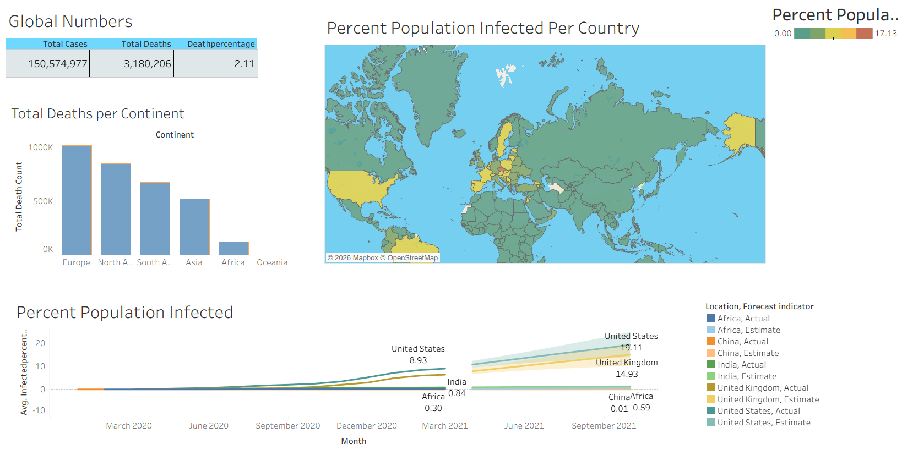

# COVID-19 Data Exploration – SQL & Tableau

## Project Overview

This project explores COVID-19 data using SQL Server to analyze cases, deaths, and vaccinations across different countries and regions.

The analysis was performed to identify key COVID-19 metrics and trends and prepare the results for visualization in Tableau.

## Tools Used

* SQL Server
* SQL Server Management Studio (SSMS)
* Tableau

## Analysis Performed

The project includes analysis of:

* Total COVID-19 cases
* Total COVID-19 deaths
* Death percentage
* Percentage of population infected
* Countries with the highest infection rates
* Countries with the highest death counts
* Continent-level COVID-19 statistics
* Global COVID-19 numbers
* Population vs. vaccinations
* Rolling vaccination counts
* Percentage of population vaccinated

## SQL Concepts Used

* SELECT
* WHERE
* GROUP BY
* ORDER BY
* Aggregate functions
* CASE statements
* JOIN
* CTE
* Temporary tables
* Window functions
* SUM() OVER()
* PARTITION BY
* Subqueries
* Views

## Tableau Dashboard

The SQL analysis was prepared for visualization in Tableau.

The dashboard presents COVID-19 cases, deaths, infection rates, and vaccination trends.

## Project Files

* `Covid data exploration.sql` – SQL queries used for COVID-19 data exploration and analysis.
* `covid dashboard1.twb` – Tableau workbook containing the COVID-19 dashboard.
* `covid-dashboard.png` – Screenshot of the Tableau dashboard.
* `README.md` – Project documentation.

## Project Outcome

This project demonstrates the use of SQL for extracting, transforming, and analyzing real-world COVID-19 data and preparing the results for visualization in Tableau.

## Project Source

This project was completed as part of my Data Analyst learning and portfolio development.
